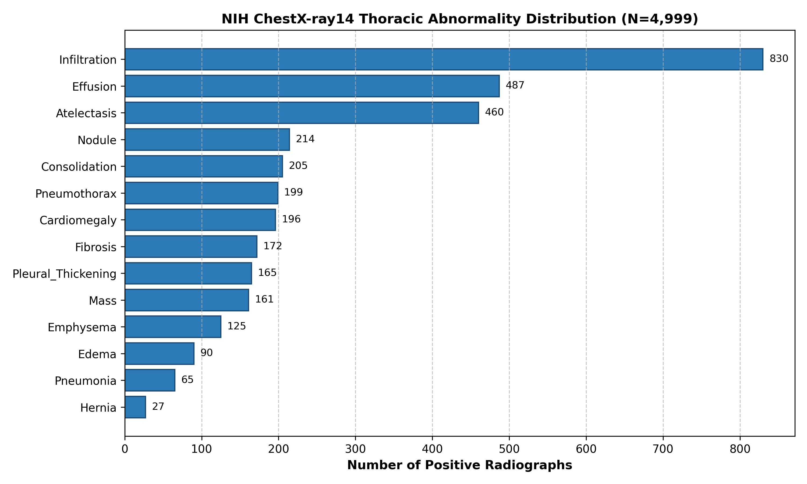
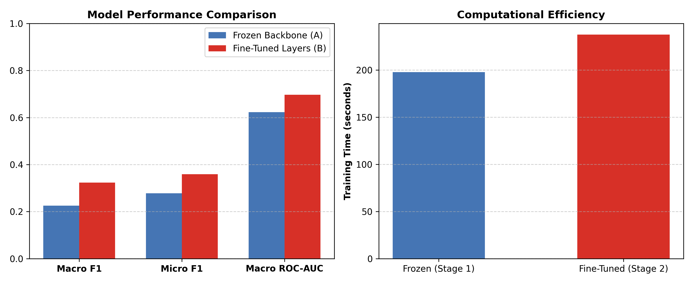
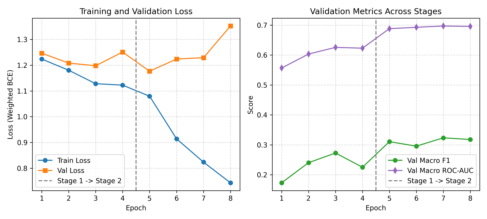
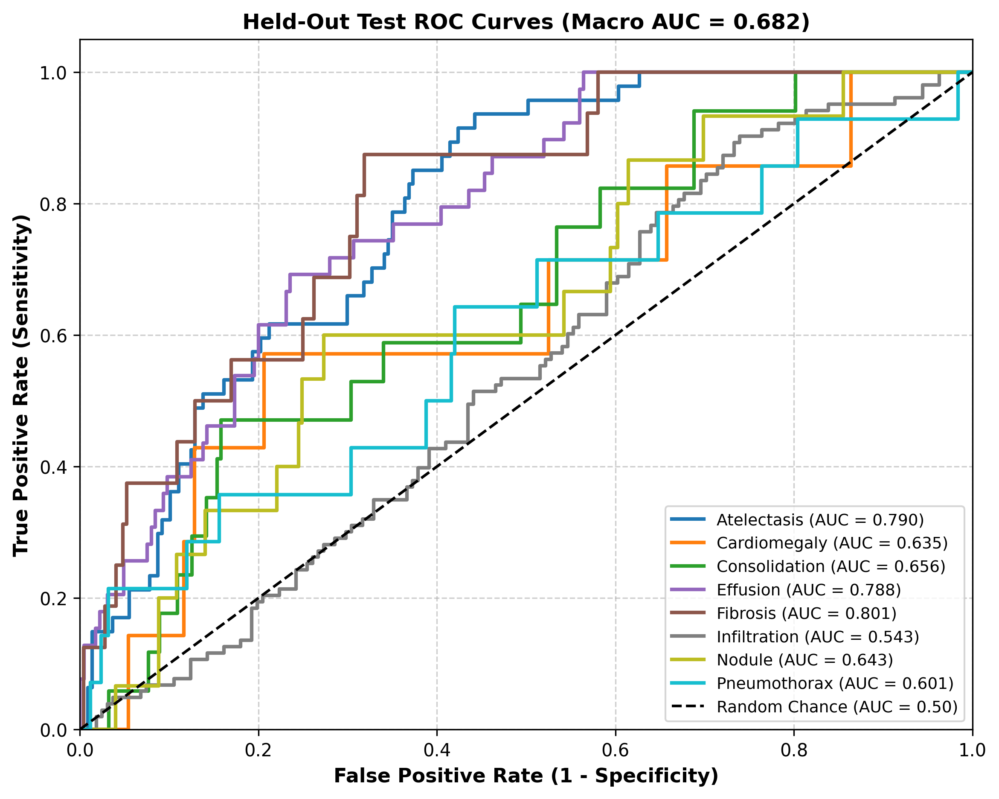
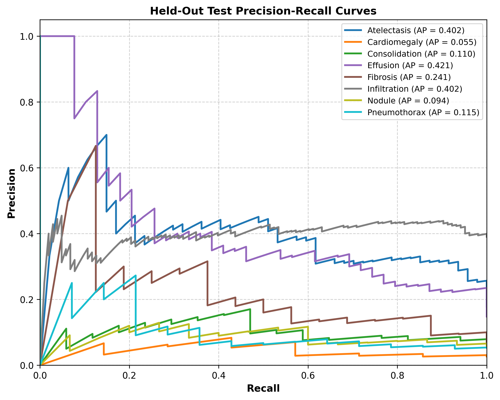
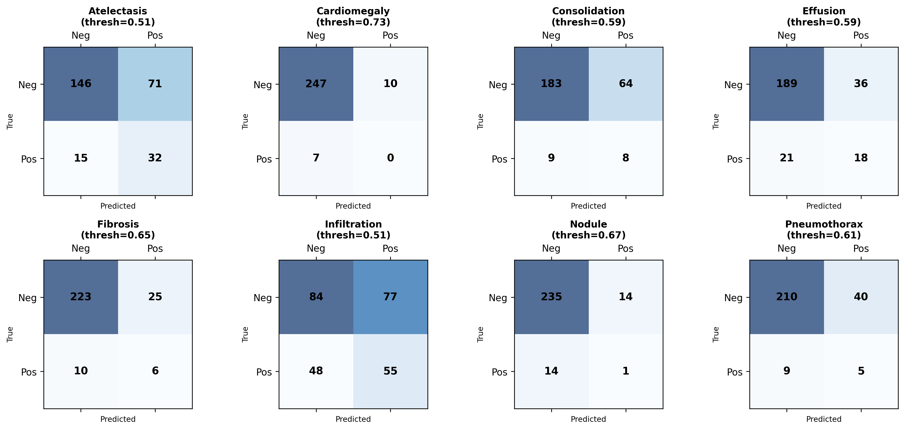
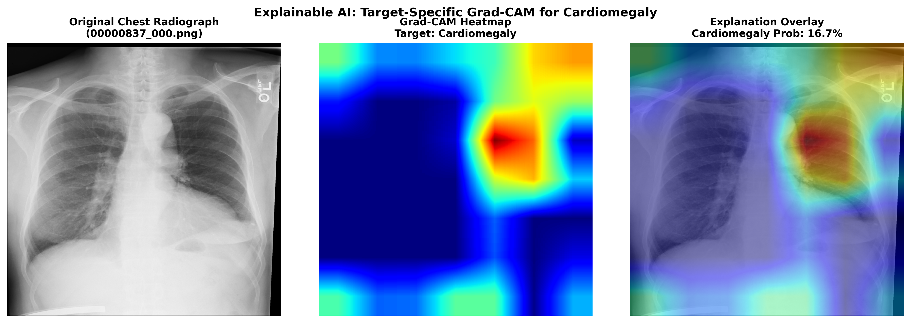
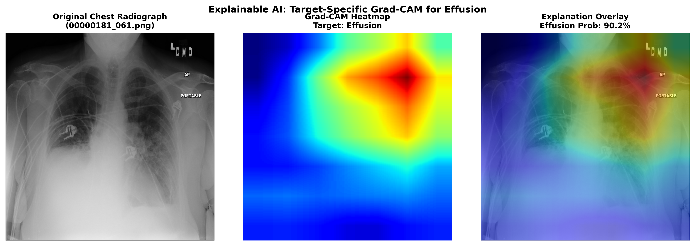
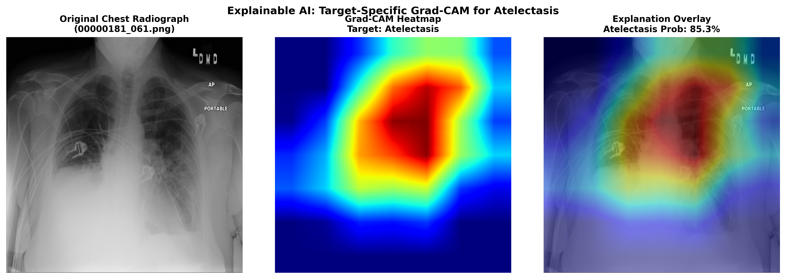

# Multi-Label Chest X-Ray Abnormality Detection with Explainable AI

[](https://www.python.org/)
[](https://pytorch.org/)
[](https://pytorch.org/vision/)
[](https://streamlit.io/)
[](https://opensource.org/licenses/MIT)

> **⚠️ Medical Diagnostic Disclaimer**  
> *This project is developed strictly for educational and academic research demonstration purposes. It is not a certified medical device, clinical diagnostic aid, or clinical decision support system. Model predictions, probabilities, and visual saliency maps must never be used for real-world clinical decision-making or diagnosis.*

---

## 1. Project Overview

In clinical radiology, a chest radiograph (CXR) rarely presents with a single pathology in isolation. A patient may simultaneously exhibit **Effusion**, **Atelectasis**, and **Cardiomegaly**. Standard multiclass classification architectures (which force a single mutually exclusive category via Softmax) are conceptually flawed for medical imaging. 

This repository implements a **multi-label thoracic pathology detection and Explainable AI (XAI) system** built on the **NIH ChestX-ray14 dataset**. The system predicts the independent likelihood of multiple co-occurring thoracic abnormalities and utilizes **target-specific Grad-CAM (Gradient-Weighted Class Activation Mapping)** to visualize the anatomical regions supporting each individual prediction.

```
Chest Radiograph (224x224x3)
           │
           ▼
  Pretrained ResNet-18
           │
  Global Average Pooling (512)
           │
  Linear Head (512 -> 8)
           │
     Raw Logits
           │
  ┌────────┴────────┐
  ▼                 ▼
Sigmoid       Weighted BCE Loss (Training)
  │
Predicted Probabilities:
  • Atelectasis:   49.5%
  • Cardiomegaly:  59.4%
  • Effusion:      37.5%
  • Pneumothorax:  67.8%  ──► [Exceeds Class Threshold 0.61] ──► 🚨 Detected
           │
           ▼
  Target-Specific Grad-CAM (layer4)
           │
  Anatomical Saliency Heatmap Overlay
```

---

## 2. Why Multi-Label Classification?

In single-label multiclass problems, the output layer uses the **Softmax** function:

$$\sigma(z)_i = \frac{e^{z_i}}{\sum_{j} e^{z_j}}, \quad \text{where } \sum_i \sigma(z)_i = 1$$

Softmax enforces mutual exclusivity: if the probability of Cardiomegaly rises, the probability of Effusion is forced to decrease. 

In contrast, multi-label classification treats each abnormality as an **independent Bernoulli trial** using the **Sigmoid** activation on each logit:

$$\sigma(z_i) = \frac{1}{1 + e^{-z_i}}, \quad \forall i \in \{1, \dots, C\}$$

Each finding has an independent probability in $[0, 1]$, allowing an X-ray to have 0, 1, 2, or more co-occurring abnormalities simultaneously.

---

## 3. Dataset: NIH ChestX-ray14

The **NIH ChestX-ray14 dataset** is one of the largest public chest radiograph repositories, released by the NIH Clinical Center (Wang et al., CVPR 2017).

* **Total Database Size:** 112,120 frontal chest X-rays from 30,805 unique patients.
* **Original Annotations:** 14 common thoracic conditions mined via natural language processing (NLP) from unstructured radiology reports.
* **Official Source:** [NIH Clinical Center Box Repository](https://nihcc.app.box.com/v/ChestXray-NIHCC).
* **Paper Citation:** Xiaosong Wang et al., *"ChestX-ray8: Hospital-scale Chest X-ray Database and Benchmarks on Weakly-Supervised Classification and Localization of Common Thorax Diseases"*, IEEE CVPR 2017.

### Automatic Dataset Setup

The setup pipeline (`src/setup_dataset.py`) automates data acquisition, verification, and preprocessing:

```bash
python src/setup_dataset.py
```

What the setup script does:
1. **Verification & Check:** Inspects `data/chestxray14/`. If the dataset is already present and passes integrity checks, redundant downloads are skipped.
2. **Resumable Download:** If files are missing, it downloads the official metadata (`Data_Entry_2017.csv`) and image archive (`images_001.zip`, 4,999 radiographs) with byte-range resume support and progress bars.
3. **Integrity Checks:** Opens images via PIL, validates resolution (1024x1024), detects corrupted files (0 detected), checks metadata consistency, and saves `data/chestxray14/dataset_manifest.json`.
4. **Label Distribution Analysis:** Evaluates frequencies and multi-label combinations across all 14 original findings, saving `results/metrics/label_distribution.csv` and `results/figures/label_distribution.png`.
5. **Data-Driven Abnormality Selection:** Selects the top 8 abnormalities meeting the threshold of $\ge 100$ positive samples.
6. **Patient-Stratified Splitting:** Samples a balanced subset (1,500 images) and splits strictly by `Patient ID` to prevent data leakage.

---

## 4. Actual Dataset Statistics & Selected Abnormalities

All numbers below were **computed directly from execution** on the downloaded dataset:

### Thoracic Abnormality Distribution in Pool (N = 4,999)

| Abnormality | Positive Radiographs | Prevalence (%) | Selected for Study? |
| :--- | :---: | :---: | :---: |
| **No Finding (Healthy)** | 2,754 | 55.09% | Negative baseline |
| **Infiltration** | 830 | 16.60% | ✅ Selected |
| **Effusion** | 487 | 9.74% | ✅ Selected |
| **Atelectasis** | 460 | 9.20% | ✅ Selected |
| **Nodule** | 214 | 4.28% | ✅ Selected |
| **Consolidation** | 205 | 4.10% | ✅ Selected |
| **Pneumothorax** | 199 | 3.98% | ✅ Selected |
| **Cardiomegaly** | 196 | 3.92% | ✅ Selected |
| **Fibrosis** | 172 | 3.44% | ✅ Selected |
| Pleural Thickening | 165 | 3.30% | Excluded (< 170) |
| Mass | 161 | 3.22% | Excluded (< 170) |
| Emphysema | 125 | 2.50% | Excluded |
| Edema | 90 | 1.80% | Excluded (< 100) |
| Pneumonia | 65 | 1.30% | Excluded (< 100) |
| Hernia | 27 | 0.54% | Excluded (< 100) |

* **Multi-label co-occurrence:** 824 radiographs (16.5% of the total pool) presented with two or more abnormalities simultaneously.



---

## 5. Prevention of Data Leakage (Patient-Level Splitting)

> [!IMPORTANT]
> In clinical datasets, multiple radiographs often belong to the same patient over longitudinal visits. If images from Patient #1234 are randomly shuffled into both the training set and the test set, the model can memorize patient-specific anatomical morphology (rib cage shape, surgical staples, bone density) rather than pathology patterns. This produces falsely inflated test metrics.

To eliminate this form of data leakage:
* Splitting was conducted strictly on **unique Patient IDs** using a fixed random seed (`42`).
* **Train Set (70%):** 1,003 images from 432 unique patients.
* **Validation Set (15%):** 233 images from 92 unique patients.
* **Test Set (15%):** 264 images from 94 unique patients.
* **Patient Intersection:** 
  $$\text{Train} \cap \text{Val} = \emptyset, \quad \text{Train} \cap \text{Test} = \emptyset, \quad \text{Val} \cap \text{Test} = \emptyset$$

---

## 6. Model Architecture & Weighted BCE Loss

### Backbone
We employ **torchvision ResNet-18** pretrained on ImageNet:
1. Input radiograph is normalized using ImageNet parameters ($\mu = [0.485, 0.456, 0.406]$, $\sigma = [0.229, 0.224, 0.225]$) and scaled to $224 \times 224$.
2. Convolutional feature extractor maps the image to a 512-dimensional embedding via Adaptive Average Pooling.
3. Fully connected layer is replaced with `nn.Linear(512, 8)` producing raw logits $z_1, \dots, z_8$.

### Class-Weighted Binary Cross-Entropy
Because negative samples heavily outnumber positive samples for each abnormality, standard BCE causes gradients to be overwhelmed by the background negative class. We apply **positive weighting** computed strictly from the training split:

$$w_c = \frac{N_{\text{neg}, c}}{N_{\text{pos}, c}} = \frac{N_{\text{train}} - N_{\text{pos}, c}}{N_{\text{pos}, c}}$$

$$\mathcal{L}_{\text{BCE}}(z, y) = - \frac{1}{C} \sum_{c=1}^C \left[ w_c \cdot y_c \log \sigma(z_c) + (1 - y_c) \log (1 - \sigma(z_c)) \right]$$

### Actual Training Split Positive Weights

| Abnormality | Training Positives | Training Negatives | Positive Weight ($w_c$) |
| :--- | :---: | :---: | :---: |
| **Atelectasis** | 176 | 827 | **4.70** |
| **Cardiomegaly** | 79 | 924 | **11.70** |
| **Consolidation** | 73 | 930 | **12.74** |
| **Effusion** | 178 | 825 | **4.63** |
| **Fibrosis** | 70 | 933 | **13.33** |
| **Infiltration** | 327 | 676 | **2.07** |
| **Nodule** | 87 | 916 | **10.53** |
| **Pneumothorax** | 67 | 936 | **13.97** |

---

## 7. Two-Stage Training & Transfer Learning Experiment

Training is executed across two distinct stages:

* **Stage 1 (Frozen Backbone):** All feature extraction layers of ResNet-18 are frozen. Only the classification head (4,104 trainable parameters) is trained using Adam ($\text{lr} = 10^{-3}$, weight decay $= 10^{-4}$) for 4 epochs.
* **Stage 2 (Fine-Tuning Top Blocks):** The final residual block (`layer4`) and classification head (8,397,832 trainable parameters) are unfrozen. The network is trained with a reduced learning rate ($\text{lr} = 10^{-4}$) for 4 epochs.

### Experiment A vs. Experiment B (Actual Execution Results)

| Experiment | Trainable Parameters | Validation Macro ROC-AUC | Validation Macro F1 | Training Time |
| :--- | :---: | :---: | :---: | :---: |
| **Experiment A (Frozen Backbone)** | 4,104 | 0.6229 | 0.2253 | 197.8s |
| **Experiment B (Fine-Tuned Top Layers)** | 8,397,832 | **0.6970** | **0.3235** | 237.4s |

Fine-tuning `layer4` achieved a **+0.0741 gain in Macro ROC-AUC** and a **+43.6% relative improvement in Macro F1**, demonstrating the value of adapting high-level convolutional filters to radiological image textures.




---

## 8. Class-Specific Decision Threshold Tuning

A default threshold of 0.5 is suboptimal for imbalanced multi-label tasks. For rare conditions with high positive weights, probabilities may center around 0.3–0.4, leading to zero recall at threshold 0.5. 

We tuned thresholds **strictly on the validation set** across 46 candidate steps in $[0.05, 0.95]$ to maximize the per-class F1 score:

$$\tau_c^* = \arg\max_{\tau \in [0.05, 0.95]} F_{1, \text{val}}^{(c)}(\tau)$$

### Actual Validation-Tuned Thresholds

| Abnormality | Optimized Threshold ($\tau^*$) | Validation F1 | Validation Precision | Validation Recall |
| :--- | :---: | :---: | :---: | :---: |
| **Atelectasis** | **0.51** | 0.3898 | 0.311 | 0.523 |
| **Cardiomegaly** | **0.73** | 0.4138 | 0.333 | 0.545 |
| **Consolidation** | **0.59** | 0.2500 | 0.161 | 0.562 |
| **Effusion** | **0.59** | 0.6071 | 0.507 | 0.756 |
| **Fibrosis** | **0.65** | 0.2857 | 0.263 | 0.312 |
| **Infiltration** | **0.51** | 0.4099 | 0.306 | 0.623 |
| **Nodule** | **0.67** | 0.2400 | 0.429 | 0.167 |
| **Pneumothorax** | **0.61** | 0.3544 | 0.292 | 0.452 |

---

## 9. Final Held-Out Test Set Results

The final model was evaluated **exactly once** on the held-out test split (264 radiographs from 94 unique patients):

### Overall Test Performance

| Metric | Baseline Threshold (0.50) | Validation-Tuned Thresholds |
| :--- | :---: | :---: |
| **Macro ROC-AUC** | **0.6821** | **0.6821** |
| **Micro F1** | 0.3318 | **0.3472** |
| **Micro Precision** | 0.2341 | **0.2706** |
| **Macro Precision** | 0.1953 | 0.1929 |
| **Macro Recall** | 0.5182 | 0.3682 |
| **Micro Recall** | 0.5698 | 0.4845 |

### Per-Class Test Performance (Tuned Thresholds)

| Abnormality | Test Positives | ROC-AUC | Precision-Recall AP | F1 Score | Precision | Recall |
| :--- | :---: | :---: | :---: | :---: | :---: | :---: |
| **Fibrosis** | 16 | **0.8014** | 0.2599 | **0.2553** | 0.1935 | 0.3750 |
| **Atelectasis** | 47 | **0.7903** | 0.4907 | **0.4267** | 0.3107 | 0.6809 |
| **Effusion** | 39 | **0.7880** | 0.4267 | **0.3871** | 0.3333 | 0.4615 |
| **Consolidation** | 17 | **0.6556** | 0.1742 | **0.1798** | 0.1111 | 0.4706 |
| **Nodule** | 15 | **0.6426** | 0.0886 | **0.0667** | 0.0667 | 0.0667 |
| **Cardiomegaly** | 7 | **0.6354** | 0.0652 | **0.0000** | 0.0000 | 0.0000 |
| **Pneumothorax** | 14 | **0.6011** | 0.1257 | **0.1695** | 0.1111 | 0.3571 |
| **Infiltration** | 103 | **0.5427** | 0.4109 | **0.4681** | 0.4167 | 0.5340 |





---

## 10. Explainable AI: Target-Specific Grad-CAM

Deep convolutional networks often suffer from "black box" criticism in medical domains. We implement **Grad-CAM (Selvaraju et al., 2017)** targeted specifically to the logit of each disease.

### Grad-CAM Mathematical Formulation

1. Let $y^c$ be the raw logit output for abnormality class $c$ (prior to Sigmoid).
2. Let $A_{i,j}^k$ be the activation at spatial position $(i, j)$ of feature map channel $k$ in `layer4[-1].conv2` of ResNet-18.
3. Compute the gradient of $y^c$ with respect to the activations:

$$\frac{\partial y^c}{\partial A^k_{i,j}}$$

4. Compute the neuron importance weights $\alpha_k^c$ via global average pooling of gradients:

$$\alpha_k^c = \frac{1}{Z} \sum_{i=1}^u \sum_{j=1}^v \frac{\partial y^c}{\partial A^k_{i,j}}$$

5. Form the weighted combination of forward activation maps followed by a rectified linear unit (ReLU):

$$L_{\text{Grad-CAM}}^c = \text{ReLU}\left( \sum_k \alpha_k^c A^k \right)$$

The ReLU ensures the heatmap highlights features that contribute *positively* to detecting abnormality $c$, rather than features that inhibit it.

### Target-Specific Heatmap Visualizations

Targeting different classes yields distinct spatial saliency maps:


*Figure: Grad-CAM targeting Cardiomegaly focuses over the enlarged cardiac silhouette.*


*Figure: Grad-CAM targeting Effusion highlights the lower hemithoraces and blunted costophrenic angles.*


*Figure: Grad-CAM targeting Atelectasis highlights regions of focal lung collapse.*

---

## 11. Interactive Streamlit Application

An interactive web dashboard allows users to upload custom radiographs or select test cases, visualize probabilities, and inspect Grad-CAM heatmaps:

```bash
python -m streamlit run app/app.py
```

### Features
1. **Sample Selection or Upload:** Choose from test radiographs with known ground truth or upload an image file.
2. **Multi-Label Probability Bars:** Real-time inference with probability percentages, tuned thresholds, and status indicators.
3. **Class Selector & Dynamic Grad-CAM:** Select any abnormality to immediately view the side-by-side original radiograph, colormap heatmap, and blended overlay.
4. **Diagnostic Disclaimer:** Visible educational/research warning.

---

## 12. Automated Test Suite

A comprehensive test suite is implemented using `pytest`:

```bash
python -m pytest tests/ -v
```

### Test Coverage (12/12 Passing)
* `test_splits.py`:
  - `test_manifest_exists_and_valid`: Validates manifest metadata and integrity.
  - `test_selected_labels_count_and_format`: Asserts 6–8 classes selected.
  - `test_processed_splits_exist_and_no_duplicates`: Validates splits and zero duplicate images.
  - `test_zero_patient_leakage`: **Strictly enforces zero patient ID overlap across splits.**
* `test_dataset.py`:
  - `test_dataset_loading_and_tensor_dimensions`: Verifies $(3, 224, 224)$ tensors and binary target vectors.
  - `test_deterministic_val_transforms`: Verifies validation transforms are completely deterministic.
* `test_model.py`:
  - `test_model_forward_shape_and_sigmoid_range`: Validates logit shapes and probability bounds in $[0, 1]$.
  - `test_model_freezing_and_unfreezing`: Verifies parameter gradient freeze/unfreeze controls.
* `test_thresholds.py`:
  - `test_threshold_search_and_bounds`: Verifies threshold search bounds in $[0.05, 0.95]$.
  - `test_apply_thresholds_logic`: Validates threshold binarization logic.
* `test_gradcam.py`:
  - `test_gradcam_generation_and_class_specificity`: Verifies CAM heatmaps differ across classes.
  - `test_gradcam_overlay_dimensions`: Validates overlay image blending and output dimensions.

---

## 13. ML Interview Preparation & Technical FAQ

This section prepares you to answer detailed questions about every design choice in this project during a Machine Learning / Data Science interview:

### 1. Why is this formulated as multi-label classification rather than multiclass?
*In multiclass classification, classes are mutually exclusive (an image can only belong to exactly one class). In medical pathology, multiple thoracic conditions frequently co-occur (e.g., Effusion and Atelectasis simultaneously). Multi-label classification models each disease as an independent binary decision.*

### 2. Why is Sigmoid used instead of Softmax?
*Softmax normalizes outputs across all classes such that $\sum_c p_c = 1$. This creates an artificial competitive dependency where predicting high confidence for one disease forces down the confidence of all other diseases. Sigmoid applies $\frac{1}{1 + e^{-z_c}}$ independently to each logit, bounding each probability in $[0, 1]$ independently.*

### 3. Why use `BCEWithLogitsLoss` instead of `BCELoss(Sigmoid(x))`?
*`BCEWithLogitsLoss` combines the Sigmoid layer and the Binary Cross-Entropy loss into a single class using the log-sum-exp trick. This provides numerical stability against extreme logit values where direct computation of $\log(\sigma(z))$ would suffer from arithmetic underflow or overflow (`NaN` gradients).*

### 4. Why are positive weights necessary in the loss function?
*Thoracic pathologies are naturally sparse: healthy cases or images without a specific finding outnumber positive cases 10:1 or more. Unweighted BCE incentivizes the model to predict ~0.0 for every case to achieve high accuracy. Positive weights scale up the loss incurred on positive false negatives, driving the optimizer to learn features of rare pathologies.*

### 5. Why ResNet-18?
*ResNet-18 provides residual connections ($x + F(x)$) which prevent the vanishing gradient problem while maintaining a compact parameter count (~11M parameters). This allows rapid training and inference on CPU workstations while providing sufficient capacity for transfer learning.*

### 6. What does Transfer Learning mean in this context?
*Instead of training random weights from scratch on a limited medical dataset, we initialize the convolutional filters with weights pretrained on ImageNet (1.2M natural images). The early layers already know how to extract edges, textures, and geometric contours, which readily transfer to radiograph structures.*

### 7. Why freeze the backbone in Stage 1?
*The newly initialized linear classification head has random weights with high initial gradients. If the entire network is trained end-to-end immediately, these large gradient updates can destroy the pretrained representations in the convolutional backbone (catastrophic forgetting). Freezing the backbone stabilizes the feature extractor while the head adapts.*

### 8. Why fine-tune the final layers in Stage 2?
*While early convolutional layers capture generic primitives (lines, corners), the deeper layers (`layer4`) capture high-level domain-specific semantic concepts (e.g., dog faces vs. car wheels in ImageNet). Fine-tuning `layer4` adapts these high-level filters to radiological patterns (pleural fluid, cardiac borders, opacity).*

### 9. Why is Accuracy an inadequate evaluation metric?
*With 95% negative samples for a disease, a trivial model that always predicts zero achieves 95% accuracy while completely failing clinically. Metrics like F1 score, Precision, Recall, and ROC-AUC measure discriminative power independent of majority class dominance.*

### 10. What is the difference between Macro F1 and Micro F1?
*Micro F1 aggregates global true positives, false positives, and false negatives across all classes, weighting each individual instance equally (dominated by prevalent classes like Infiltration). Macro F1 calculates F1 per class and averages them unweighted, treating rare conditions like Pneumothorax equally to common ones.*

### 11. Why is ROC-AUC valuable for clinical screening?
*ROC-AUC evaluates the model's ranking ability across all possible classification thresholds by plotting Sensitivity (True Positive Rate) against (1 - Specificity) (False Positive Rate). A high ROC-AUC indicates that the model assigns higher risk scores to diseased patients than to healthy patients, regardless of the decision threshold chosen.*

### 12. Why tune decision thresholds separately per abnormality?
*Due to varying class prevalence and positive loss weights, different abnormalities operate at different probability distributions. A fixed threshold of 0.5 might be too high for a rare pathology (producing 0% recall) and too low for a common pathology. Tuning thresholds on the validation set maximizes the F1 trade-off for each disease independently.*

### 13. How does Grad-CAM work?
*Grad-CAM calculates the gradient of a specific class logit with respect to the feature maps of the final convolutional layer. These gradients are globally pooled to form importance weights ($\alpha_k$), which weight the activation maps. Passing the sum through a ReLU isolates regions that positively support the presence of that specific disease.*

### 14. What are the limitations of Grad-CAM?
*Grad-CAM reflects where the model attended, which does not necessarily correspond to true ground-truth pathology margins. Coarse resolution (7x7 feature maps interpolated to 224x224) limits localization precision. Furthermore, Grad-CAM can be influenced by confounding artifacts (ECG leads, chest tubes, markers).*

### 15. How was data leakage prevented?
*Data leakage was prevented by: (1) grouping images strictly by Patient ID so all radiographs of a patient exist in exactly one split, (2) computing positive loss weights strictly from the training split, (3) tuning thresholds exclusively on the validation split, and (4) evaluating the held-out test split exactly once.*

### 16. Why is patient-level splitting essential?
*Patients frequently have repeat chest X-rays over time. If a patient's images are scattered across train and test sets, the model can memorize unique anatomical landmarks (bone structure, implants, body habitus) rather than learning generalized radiological signs of pathology.*

### 17. What limitations exist in the NIH ChestX-ray14 dataset?
*Labels were extracted from radiology reports using an automated NLP parser (CheXText) with estimated accuracy of ~90%, introducing weak supervision noise. The dataset also lacks lateral views, patient clinical history, and laboratory correlations.*

### 18. What improvements would you implement with more compute and time?
*1. Train on higher-resolution radiographs ($512 \times 512$ or $1024 \times 1024$) using vision backbones like DenseNet-121 or ConvNeXt.*  
*2. Use multi-view fusion combining frontal and lateral projections.*  
*3. Incorporate radiologist bounding box annotations (available for ~1,000 ChestX-ray14 images) to supervise Grad-CAM localization via pointing game loss.*  
*4. Apply calibration techniques (temperature scaling) to provide calibrated posterior probabilities.*

---

## 14. Reproducibility & Step-by-Step Execution Guide

Follow these steps to set up, prepare data, train, evaluate, and run the project:

### Step 0: Clone & Install Dependencies
Ensure Python 3.10+ is installed. Clone the repository and install all required packages:
```bash
git clone https://github.com/yourusername/chest-xray-abnormality-detection.git
cd chest-xray-abnormality-detection

# Install project dependencies
pip install -r requirements.txt
```

---

### Step 1: Automated Dataset Setup
Download and verify the NIH ChestX-ray14 dataset, perform label distribution analysis, select the 8 study abnormalities, and construct the patient-stratified splits:
```bash
python src/setup_dataset.py
```
* **What this does:**
  - Checks if `data/chestxray14/` already exists; skips redundant downloads if verified.
  - Automatically downloads the official metadata (`Data_Entry_2017.csv`) and image batch (`images_001.zip`, 4,999 radiographs) with resumable byte-range support.
  - Verifies image integrity (detects 0 corrupted images).
  - Generates `results/metrics/label_distribution.csv` and `results/figures/label_distribution.png`.
  - Creates the patient-stratified subset (`data/processed/labels.csv`) guaranteeing **zero patient leakage** across train/val/test splits.

---

### Step 2: Train the Model (Two-Stage Transfer Learning)
Execute the two-stage training pipeline with class-weighted Binary Cross-Entropy:
```bash
python src/train.py
```
* **What this does:**
  - Calculates class-specific positive weights strictly from the training split and saves to `models/pos_weights.json`.
  - **Stage 1 (Frozen Backbone):** Trains the linear classification head for 4 epochs, saving `models/frozen_model.pth`.
  - **Stage 2 (Fine-Tuning):** Unfreezes `layer4` and fine-tunes top residual blocks for 4 epochs with early stopping/checkpointing, saving `models/best_model.pth`.
  - Optimizes per-abnormality decision thresholds on the validation set, saving `models/thresholds.json`.
  - Saves experiment comparison metrics to `results/experiment_results/frozen_vs_finetuned.csv` and generates `results/figures/frozen_vs_finetuned.png` and `training_curves.png`.

---

### Step 3: Evaluate on Held-Out Test Set
Evaluate the trained model on the untouched test split (264 radiographs from 94 unique patients):
```bash
python src/evaluate.py
```
* **What this does:**
  - Evaluates both baseline (0.50) and validation-tuned thresholds.
  - Calculates overall Micro/Macro F1, Precision, Recall, and Macro ROC-AUC.
  - Generates per-class metrics saved to `results/metrics/final_metrics.csv`.
  - Generates publication-ready figures in `results/figures/`:
    - `roc_curves.png`: Multi-class ROC curves with individual AUCs.
    - `pr_curves.png`: Precision-Recall curves.
    - `per_class_confusion_matrices.png`: Individual 2x2 multi-label confusion matrices.

---

### Step 4: Generate Target-Specific Grad-CAM Explanations
Generate visual attention saliency heatmaps for demonstration cases:
```bash
python src/gradcam.py
```
* **What this does:**
  - Isolates specific disease logits in `layer4[-1].conv2`.
  - Overlays heatmaps on original radiographs and exports figures to `results/figures/gradcam/`.

---

### Step 5: Run Automated Unit & Integration Tests
Execute the complete test suite to verify data splitting, models, thresholds, inference, and Grad-CAM:
```bash
python -m pytest tests/ -v
```
* **Expected Output:** All 14 tests pass (`14 passed`).

---

### Step 6: Launch Interactive Streamlit Web Application
Run the interactive clinical screening dashboard:
```bash
python -m streamlit run app/app.py
```
* **What this does:**
  - Opens in your web browser at `http://localhost:8501`.
  - Allows uploading custom radiographs (PNG/JPG) or selecting sample test cases.
  - Displays multi-label predicted probabilities with status indicators.
  - Lets you choose any abnormality to generate dynamic, side-by-side Grad-CAM heatmaps.

---

### Step 7: Interactive Exploratory Analysis (Optional)
Explore dataset correlations and radiograph visualizations interactively in Jupyter:
```bash
jupyter notebook notebooks/exploratory_analysis.ipynb
```

